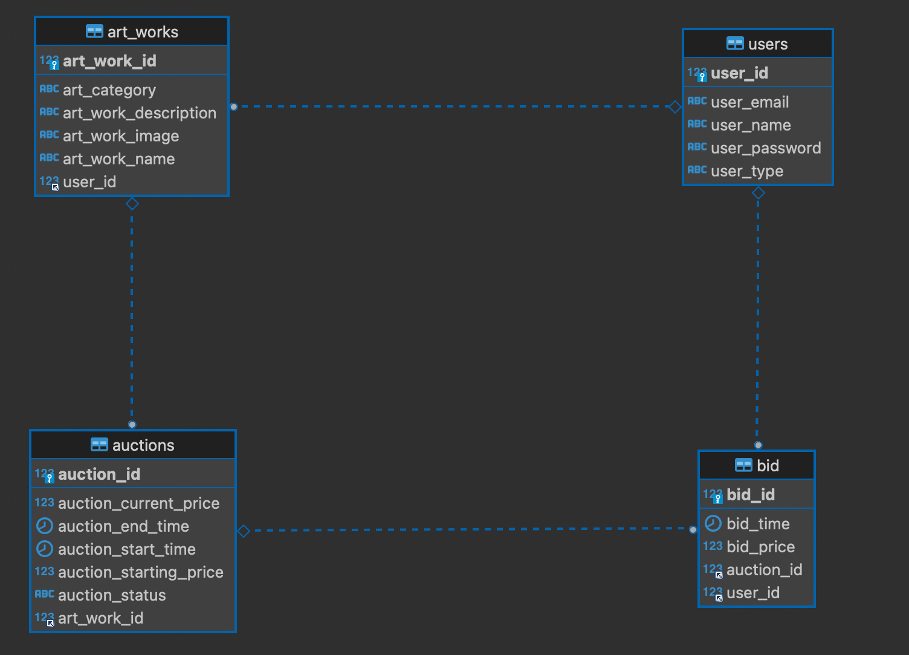

# 📝Art-Auction 미술품 경매 (REST API)

## 프로젝트 소개

#### Art-Auction은 미술품 경매를 위한 REST API 서비스입니다. 사용자들이 미술품을 등록하고 경매를 진행할 수 있는 플랫폼을 제공합니다.

#### 미술품을 사고 팔고자 하는 사용자들은 회원 가입을 통해 Art-Auction에 참여할 수 있습니다.

### 💻 사용 기술

- JAVA 17
- Spring MVC
- Spring Boot
- Spring Jpa
- Spring data redis
- Spring Scheduled
- lombok

### Build Tool

- Gradle

### Database

- MYSQL

### 💻 개발환경

- IntelliJ
- redis
- Github(Git bash)

## 주요 기능 소개

### 1. 사용자 관리

- 사용자 등록: 새로운 사용자를 등록하고, 생성된 사용자 아이디를 반환합니다.
- 사용자 정보 수정: 기존 사용자 정보를 업데이트하고, 수정된 사용자의 아이디를 반환합니다.
- 사용자 삭제: 특정 사용자를 삭제합니다.
- 사용자 조회: 특정 사용자의 정보를 조회하여 아이디, 이름, 이메일 및 사용자 유형을 반환합니다.

### 2. 작품 등록 및 관리

- 작품 등록: 사용자가 작품을 등록하고, 생성된 작품 아이디를 반환합니다.
- 작품 정보 수정: 등록된 작품 정보를 업데이트하고, 수정된 작품의 아이디를 반환합니다.
- 작품 삭제: 특정 작품을 삭제합니다.
- 카테고리별 작품 조회: 특정 카테고리에 속하는 작품들을 조회합니다.
- 사용자별 작품 조회: 특정 사용자가 등록한 작품들을 조회합니다.

### 3. 경매 등록 및 관리

- 경매 등록: 사용자가 작품에 대한 경매를 등록하고, 생성된 경매 아이디를 반환합니다.
- 경매 정보 조회: 특정 경매의 정보를 조회하여 현재 입찰가 및 상태를 반환합니다.(redis를 통해 현재값 제공)
- 작품별 경매 조회: 특정 작품에 대한 경매 리스트를 조회합니다.

### 4. 입찰 등록 및 관리

- 입찰 등록: 사용자가 경매에 대한 입찰을 등록하고, 생성된 입찰 아이디를 반환합니다. 입찰가가 redis에 저장됩니다.
- 사용자별 입찰 조회: 특정 사용자가 등록한 입찰 리스트를 조회합니다.
- 경매별 입찰 조회: 특정 경매에 대한 입찰 리스트를 조회합니다.

### 5. 스케줄러

- 자동 업데이트: 주기적으로 스케줄러가 실행되므로 수동으로 상태를 업데이트할 필요 없이 경매 상태를 자동으로 갱신합니다.
- 실시간 반영: 경매 시작 시간과 종료 시간에 따라 실시간으로 경매 상태를 변경하여 사용자에게 정확하고 실시간의 정보를 제공합니다.
- 데이터베이스 부하 감소: 주기적으로 스케줄러가 동작하면서 데이터베이스 조회가 빈번하지 않아도 되므로 데이터베이스 부하를 줄일 수 있습니다.
- 경매 시스템의 안정성: 스케줄러를 통해 경매 상태를 자동으로 관리하므로 경매 시스템의 안정성과 일관성을 유지할 수 있습니다.

### 6. Redis

- 빠른 속도 조회: 경매 조회 시에 레디스에 저장된 최고가를 가져오기 때문에 별도의 데이터베이스 쿼리를 날릴 필요가 없습니다. 데이터베이스 조회보다 레디스에서 데이터를 가져오는 속도가 훨씬 빠르기 때문에 사용자에게
  더 빠른 응답 시간을 제공할 수 있습니다.

- 데이터베이스 부하 감소: 레디스에 최고가 정보를 저장함으로써 데이터베이스의 부하를 줄일 수 있습니다. 경매가 진행되면서 입찰이 많이 들어오면 데이터베이스의 업데이트 쿼리가 빈번하게 실행되는데, 이를 레디스에
  저장하면 데이터베이스에 대한 부하를 분산시킬 수 있습니다

- 실시간 업데이트: 레디스는 메모리 기반의 데이터 저장소로서 데이터에 접근 속도가 매우 빠릅니다. 따라서 실시간으로 입찰 정보가 업데이트되고 레디스에 저장되기 때문에 사용자는 항상 최신의 경매 정보를 받아볼 수
  있습니다.

#

### 위 그림과 같이 DB에 bid값이 갱신되지 않았지만 redis를 통하여 auction을 조회하면 현재가격이 갱신된 금액으로 조회되는것을 확인 할 수 있습니다.

## ERD 다이어그램

## 목차

1. [User API](#User-api)
2. [Artwork API](#ArtWork-API)
3. [Auction API](#Auction-API)
4. [Bid API](#Bid-API)

# User API

## Create User

- URL: POST /users
- Request Body: 사용자 정보 (userName, email, password, userType)
- Response: 생성된 사용자의 아이디 (userId)

사용자를 생성하는 API입니다. 요청으로 받은 사용자 정보를 바탕으로 새로운 사용자를 생성하고, 생성된 사용자의 아이디를 응답합니다.

## Update User

- URL: PATCH /users/{userId}
- Path Variable: userId (수정할 사용자의 아이디)
- Request Body: 수정할 사용자 정보 (email, userName, password, userType)
- Response: 수정된 사용자의 아이디 (userId)

특정 사용자의 정보를 수정하는 API입니다. 경로 변수로 수정할 사용자의 아이디를 받고, 요청으로 수정할 정보를 전달받습니다. 해당 사용자가 존재하면 정보를 수정하고, 수정된 사용자의 아이디를 응답합니다.
이 과정에서 해당 필드의 모든 값이 들어오지 않아도 일부만 갱신됩니다.

## Delete User

- URL: DELETE /users/{userId}
- Path Variable: userId (삭제할 사용자의 아이디)
- Response: 204 No Content

특정 사용자를 삭제하는 API입니다. 경로 변수로 삭제할 사용자의 아이디를 받고, 해당 사용자가 존재하면 삭제합니다. 삭제 후 응답은 204 No Content로 응답합니다.

## Get User

- URL: GET /users/{userId}
- Path Variable: userId (조회할 사용자의 아이디)
- Response: 사용자 정보 (userId, userName, email, userType)

특정 사용자를 조회하는 API입니다. 경로 변수로 조회할 사용자의 아이디를 받고, 해당 사용자가 존재하면 사용자의 정보를 응답합니다. 응답으로는 사용자의 아이디, 이름, 이메일 및 사용자 유형이 포함됩니다.

# ArtWork API

## Create Artwork

- URL: POST /artworks
- Request Body: 작품 정보 (userId, name, description, image, categoryType)
- Response: 생성된 작품의 아이디 (artWorkId)

작품을 등록하는 API입니다. 요청으로 받은 작품 정보를 바탕으로 새로운 작품을 생성하고, 생성된 작품의 아이디를 응답합니다.
이 과정에서 작품을 등록 할 수 있는 권한이 있는 user만 호출이 가능합니다.

## Update Artwork

- URL: PATCH /artworks/{artWorkId}
- Path Variable: artWorkId (수정할 작품의 아이디)
- Request Body: 수정할 작품 정보 (name, description, image, categoryType)
- Response: 수정된 작품의 아이디 (artWorkId)

특정 작품의 정보를 수정하는 API입니다. 경로 변수로 수정할 작품의 아이디를 받고, 요청으로 수정할 정보를 전달받습니다. 해당 작품이 존재하면 정보를 수정하고, 수정된 작품의 아이디를 응답합니다.

## Delete Artwork

- URL: DELETE /artworks/{artWorkId}
- Path Variable: artWorkId (삭제할 작품의 아이디)
- Response: 204 No Content

특정 작품을 삭제하는 API입니다. 경로 변수로 삭제할 작품의 아이디를 받고, 해당 작품이 존재하면 삭제합니다. 삭제 후 응답은 204 No Content로 응답합니다.

## Get Artwork by Category

- URL: GET /artworks/category/{categoryType}
- Path Variable: categoryType (조회할 작품 카테고리)
- Response: 작품 리스트 (artWorkId, name, description, image, categoryType)

특정 카테고리의 작품을 조회하는 API입니다. 경로 변수로 조회할 작품 카테고리를 받고, 해당 카테고리에 속하는 작품들을 응답합니다.

## Get Artwork by User

- URL: GET /artworks/user/{userId}
- Path Variable: userId (조회할 작품 소유자의 아이디)
- Response: 작품 리스트 (artWorkId, name, description, image, categoryType)

특정 사용자의 작품을 조회하는 API입니다. 경로 변수로 조회할 작품 소유자의 아이디를 받고, 해당 사용자가 등록한 작품들을 응답합니다.

# Auction API

## Post Auction

- URL: POST /auctions
- Request Body: 경매 정보 (artWorkId, startTime, endTime, startingPrice)
- Response: 생성된 경매의 아이디 (auctionId)

경매를 등록하는 API입니다. 요청으로 받은 경매 정보를 바탕으로 새로운 경매를 생성하고, 생성된 경매의 아이디를 응답합니다. 이 과정에서 경매를 등록 할 수 있는 권한이 있는 유저만 호출이 가능합니다.

## Get Auction

- URL: GET /auctions/{auctionId}
- Path Variable: auctionId (조회할 경매의 아이디)
- Response: 경매 정보 (itemName, currentPrice, status)

특정 경매를 조회하는 API입니다. 경로 변수로 조회할 경매의 아이디를 받고, 해당 경매의 정보를 응답합니다.
이 과정에서 경매 정보의 현재 가격은 redis를 통해 bid의 최고 입찰금액을 리턴합니다.

## Get Auction by Artwork

- URL: GET /auctions/artwork/{artWorkId}
- Path Variable: artWorkId (조회할 작품의 아이디)
- Response: 경매 리스트 (auctionId, startTime, endTime, startingPrice, currentPrice, status)

특정 작품의 경매를 조회하는 API입니다. 경로 변수로 조회할 작품의 아이디를 받고, 해당 작품에 대한 경매 리스트를 응답합니다.

# Bid API

## Post Bid

- URL: POST /bids
- Request Body: 입찰 정보 (userId, auctionId, price)
- Response: 생성된 입찰의 아이디 (bidId)

입찰을 등록하는 API입니다. 요청으로 받은 입찰 정보를 바탕으로 새로운 입찰을 생성하고, 생성된 입찰의 아이디를 응답합니다. 이 과정에서 입찰을 등록 할 수 있는 권한이 있는 유저만 호출이 가능합니다. 또한, 입찰
금액의 유효성 검사를 통해 시작 가격보다 낮거나 현재 가격보다 낮은 입찰을 방지합니다.

이미 유저가 해당 경매에 대한 입찰이 있을 경우 새로 생성하지 않고 갱신해줍니다. 또한 입찰이 들어오는 경우 해당 옥션 id를 key 입찰금액을 value로 redis에 저장합니다.

## Get Bid by User

- URL: GET /bids/user/{userId}
- Path Variable: userId (조회할 유저의 아이디)
- Response: 입찰 리스트 (auctionId, auctionStatus, price, bidTime)

특정 유저가 등록한 입찰을 조회하는 API입니다. 경로 변수로 조회할 유저의 아이디를 받고, 해당 유저가 등록한 입찰 리스트를 응답합니다.

## Get Bid by Auction

URL: GET /bids/auction/{auctionId}

- Path Variable: auctionId (조회할 경매의 아이디)
- Response: 입찰 리스트 (userName, price, bidTime)

특정 경매에 대한 입찰 리스트를 조회하는 API입니다. 경로 변수로 조회할 경매의 아이디를 받고, 해당 경매에 대한 입찰 리스트를 응답합니다.

## 📝 추가하면 좋을 기능

- 알림 기능: 경매가 종료되거나 입찰이 갱신될 때 사용자에게 알림(FCM)을 전송하는 기능을 추가할 예정입니다.
- 리뷰 및 평가: 사용자가 작품을 거래한 후 리뷰와 평가를 남길 수 있도록 기능을 추가합니다.
- ** 동시성 처리: 하나의 경매에 여러개의 입찰이 동시에 발생할 때 동시성을 처리하기 위해 옵티미스 락 혹은 메시지 큐를 이용하여 동시성 문제를 해결할 예정입니다.**

